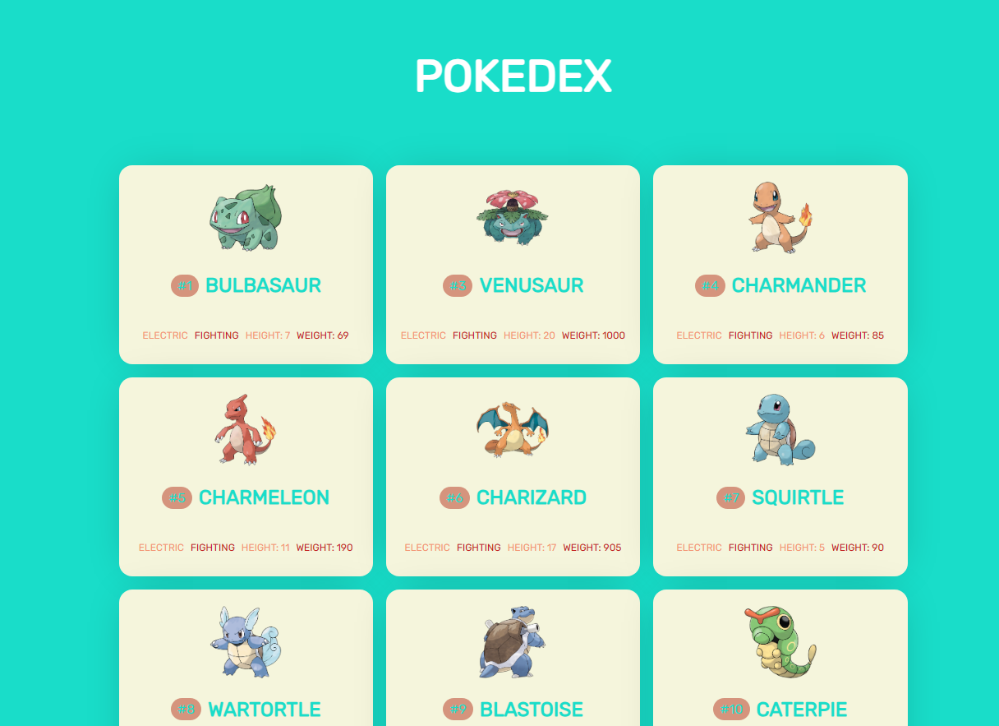
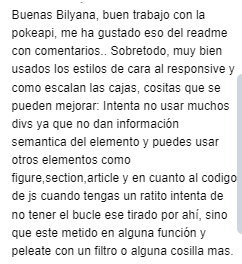

PokeApi in English :
List the first 150 Pokémon, the real ones from the 1st generation, for this you will have to handle the asynchronous nature and make a request to retrieve the Pokémon. In addition to dynamically painting each of them.
In my JavaScript file, I'll have to follow the following function flow:

Retrieve the list with the id "podekex" and store it in a variable.

Execute the fetch using a function to retrieve the first 150 Pokemon through a for loop and indicate the correct endpoint of the API. In this case, we will retrieve them from the following URL: https://pokeapi.co/api/v2/pokemon/

The first thing I did was to create the layout in HTML and CSS.

At this stage, I applied CSS display grid and flex so that the Pokemon cards are displayed responsively on each screen size. I decided that my cards will display the Pokemon's name, ID, and additional properties such as weight and height, just like electric or fighting type. I created several divs for this and then styled them with CSS.

In the phase of writing the JavaScript, I applied a FOR LOOP to fetch the 150 pokemons. The variable 'listaPokemon' gets information about the first 150 Pokémon from the PokeAPI, parses the data, and then displays them on a web page using the 'mostrarPokemon' function.

In the 'mostrarPokemon(poke)' function, it dynamically generates HTML content to display information about Pokémon, including its image, name, ID, types, height and weight, and adds it to a container on the web page with the id 'listaPokemon'.

[español]

Lista los primeros 150 Pokemons, los de verdad 1ª generación, para ello tendrás que manejar la asincronía y realizar una petición para recuperar los pokemons. Además de pintar de manera dinámica cada uno de ellos.
En mi archivo JavaScript tendre que seguir el siguiente flujo de funciones:

Recuperar la lista con el id "podekex" y almacenarla en una variable.

Ejecutar el fetch mediante una función recuperando los 150 primeros Pokemon a través de un bucle for e indicar el endpoint correcto de la API. En este caso los vamos a recuperar de la siguiente url: https://pokeapi.co/api/v2/pokemon/

1. Lo primero que hice fue crear la maquetacion en HTML y CSS
2. En este etapa aplique el CSS display grid y flex para que las tarjetas de los Pokemons se muestren de forma responsive en cada tamaño de pantalla. Decidi que mis tarjetas van a mostrar el nombre del pokemon, su id, y propiedades adicionales como el peso y la altura, tal y como el tipo-electric o fighting. Cree varios divs para ello que luego le di un poco de CSS.
3. En la fase de escribir el Javascript, aplique FOR LOOP para traer los 150 pokemons. la variable listaPokemon obtiene información sobre los primeros 150 Pokémon de la PokeAPI, analiza los datos y luego los muestra en una página web utilizando la función mostrarPokemon.
4. En la funcion mostrarPokemon(poke) Esta genera dinámicamente contenido HTML para mostrar información sobre Pokémon, incluyendo su imagen, nombre, ID, tipos, altura y peso, y lo añade a un contenedor en la página web con el id "listaPokemon".

